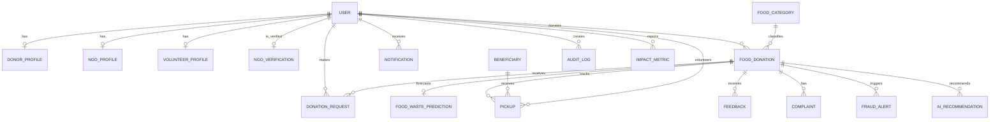

# FoodShare AI Database Documentation

## Overview
This database supports the FoodShare AI platform lifecycle: user onboarding, donor/NGO matching, donation handling, pickup tracking, notifications, fraud analysis, analytics reporting, and AI-assisted waste reduction.

## Database platform
- Local development: SQLite
- Production-ready configuration: PostgreSQL via DATABASE_URL
- ORM: Django ORM with explicit constraints, timestamps, and status fields

## Entity relationship overview

## Core model catalog

### accounts.User
Represents the platform identity used for donors, NGOs, volunteers, and admins.

Fields:
- id: primary key
- username: unique login handle
- email: login and communication address
- password: hashed auth credential
- first_name, last_name: user identity fields
- role: enum for USER, DONOR, NGO, VOLUNTEER, ADMIN
- phone_number: contact number
- is_active, is_staff, is_superuser: Django auth flags
- created_at: creation timestamp
- updated_at: last modification timestamp

Constraints and notes:
- Indexed by role and email
- Custom auth model configured in Django settings

### accounts.DonorProfile
Stores donor-specific details aligned to the custom user model.

Fields:
- id
- user: one-to-one with User where role = DONOR
- organization_name
- address, city, state, country
- is_verified
- created_at, updated_at

### accounts.NGOProfile
Stores NGO account metadata and operational context.

Fields:
- id
- user: one-to-one with User where role = NGO
- organization_name
- registration_number
- mission
- address, city, state, country
- is_verified
- created_at, updated_at

### accounts.VolunteerProfile
Tracks volunteer availability and service capability.

Fields:
- id
- user: one-to-one with User where role = VOLUNTEER
- skills
- availability
- city, state
- is_active
- created_at, updated_at

### accounts.NGOVerification
Tracks verification workflow for NGO organizations.

Fields:
- id
- ngo: one-to-one with User where role = NGO
- organization_name
- registration_number
- documents_url
- verified_by: admin user performing the check
- status: PENDING, APPROVED, REJECTED, SUSPENDED
- created_at, updated_at

### donations.FoodCategory
Represents cataloged food types for donation classification.

Fields:
- id
- name: unique category name
- slug: unique URL-safe key
- description
- created_at, updated_at

### donations.FoodDonation
Stores donor contributions and operational metadata for each donation record.

Fields:
- id
- donor: donor user reference
- food_name
- category: food category foreign key
- description
- quantity
- unit
- preparation_time
- expiry_time
- storage_condition
- pickup_address
- latitude, longitude
- image
- status: AVAILABLE, MATCHED, ACCEPTED, PICKUP_SCHEDULED, PICKED_UP, DELIVERED, COMPLETED, CANCELLED, EXPIRED, REJECTED
- created_at, updated_at

Constraints and notes:
- Quantity must be greater than zero
- Food name and pickup address are required
- Indexed by status and expiry, and by donor and status

### donations.DonationRequest
Tracks an NGO request for a donation.

Fields:
- id
- donation: related donation
- ngo: requesting NGO user
- requested_quantity
- message
- status: PENDING, ACCEPTED, REJECTED, CANCELLED
- created_at, updated_at

Constraints and notes:
- One request per donation/NGO pair
- Requested quantity must be positive

### donations.DonationMatch
Represents a match decision between a donation and an NGO request.

Fields:
- id
- donation
- request
- matched_by
- status: PENDING, ACCEPTED, REJECTED, CANCELLED
- match_score
- note
- created_at, updated_at

### matching.MatchCandidate
Stores AI or rule-based compatibility scores between a donation and request.

Fields:
- id
- donation
- request
- compatibility_score
- reason
- matched_by
- created_at

### matching.NGOMatchingProfile
Stores NGO-controlled matching inputs and administrator-maintained reliability.

Fields:
- id
- ngo: one-to-one relation to an NGO user
- accepted_categories: many-to-many relation to food categories
- latitude, longitude: optional paired coordinates, validated to geographic ranges
- capacity_kg: available mass capacity, non-negative
- current_demand_score: integer from 0 to 100
- reliability_score: administrator-managed integer from 0 to 100
- is_active
- updated_at

### matching.NGORecommendation
Persists a weighted ranking recommendation between one donation and one NGO.

Fields:
- id
- donation, ngo
- match_score: weighted ranking score from 0 to 100; not a probability
- factor_scores, factor_weights, explanation: JSON snapshots of calculation details
- distance_km: nullable when coordinates are unavailable
- status: RECOMMENDED, ACCEPTED, DECLINED, or SUPERSEDED
- created_at, updated_at, accepted_at

Constraints and notes:
- At most one active RECOMMENDED or ACCEPTED match per donation and NGO
- Match score constrained to 0–100
- Recommendations are retained for audit/history and ordered by descending score
- See [MATCHING_ENGINE_DOCUMENTATION.md](MATCHING_ENGINE_DOCUMENTATION.md) for the full scoring rules and data limitations.

### tracking.Beneficiary
Tracks individuals or organizations receiving food support.

Fields:
- id
- name
- phone_number
- city, state, address
- created_at, updated_at

### tracking.Pickup
Captures scheduled or completed pickup operations.

Fields:
- id
- donation
- beneficiary
- assigned_volunteer
- status: SCHEDULED, IN_TRANSIT, PICKED_UP, DELIVERED, CANCELLED
- pickup_window_start, pickup_window_end
- notes
- created_at, updated_at

### tracking.DeliveryLog
Records the final delivery leg of the pickup workflow.

Fields:
- id
- pickup
- delivered_by
- delivered_at
- condition
- comment

### notifications.Notification
Stores in-app notifications for recipients.

Fields:
- id
- recipient
- title
- message
- notification_type: INFO, SUCCESS, WARNING, ALERT
- is_read
- related_donation
- created_at

### feedback.Feedback
Stores user feedback on a completed or processed donation.

Fields:
- id
- user
- donation
- category
- rating: 1–5
- comment
- created_at

### feedback.Complaint
Tracks issues or disputes related to food intake or delivery flow.

Fields:
- id
- user
- donation
- title
- description
- status: OPEN, REVIEWING, RESOLVED
- created_at, updated_at

### fraud_detection.FraudAlert
Captures suspicious activities that may indicate fraud.

Fields:
- id
- actor
- donation
- alert_type
- severity / risk_level: LOW, MEDIUM, HIGH, CRITICAL
- risk_score: integer from 0 to 100
- reason
- reasons: structured reason-code JSON list
- deduplication_key
- detection_method and rule_version
- occurrence_count
- status: OPEN, REVIEWING, RESOLVED
- reviewed_by, review_outcome, review_note, reviewed_at
- last_seen_at
- created_at, updated_at

Constraints and notes:
- Risk score must be in the 0–100 range
- Only one alert per deduplication key can be OPEN or REVIEWING; resolved alerts remain available for audit
- Alerts are available through admin-authorized APIs only

### fraud_detection.AuditLog
Stores an immutable-style trace of operational actions, including fraud-alert review decisions.

Fields:
- id
- actor
- entity_type
- entity_id
- action
- message
- created_at

### analytics.ImpactMetric
Represent aggregated food-rescue impact at daily or NGO-specific granularity.

Fields:
- id
- report_date
- ngo
- meals_distributed
- kilograms_rescued
- waste_avoided_kg
- donors_engaged
- volunteers_engaged
- created_at

### ai_engine.FoodWastePrediction
Stores predictions generated by the waste forecasting model.

Fields:
- id
- donation
- predicted_waste_kg
- confidence_score
- model_version
- created_at

### ai_engine.AIRecommendation
Stores generated recommendations for donation routing or optimization.

Fields:
- id
- donation
- recommendation_type
- score
- explanation
- created_at

## Data integrity practices
- Foreign keys enforce domain relationships between users, donations, NGOs, volunteers, and tracking records.
- Status enums and check constraints prevent invalid values and broken temporal ranges.
- Time-based indexes support operational queries such as time-to-expiry and status filtering.
- Unique constraints prevent duplicate donation requests or erroneous match records.

## Migration strategy
- Use Django migrations generated from the ORM model definitions.
- Run makemigrations after schema updates and migrate in the backend virtual environment.
- Keep the schema aligned to app-level responsibilities rather than a single monolithic model file.
